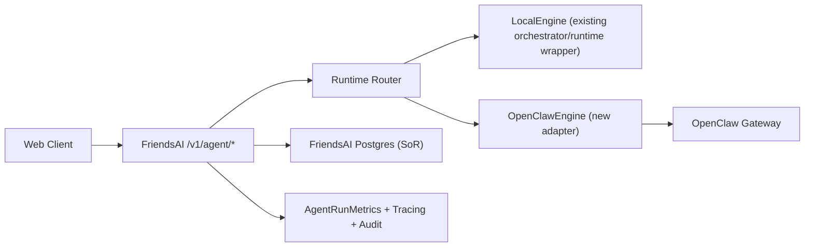

# FriendsAI 现状盘点与 OpenClaw 双栈改造方案（2026-02-18）

## 0. 文档定位
- 类型：架构评审 + 技术实现方案（决策完成版）
- 范围：FriendsAI 主仓改造方案 + OpenSpec 安装治理 + change 映射
- 目标：支持 `FriendsAI -> OpenClaw Agent Layer` 双栈替换，保持外部 API 与前端协议兼容

## 1. 当前系统盘点（As-Is）

### 1.1 Agent 对外入口与调用链
1. `POST /v1/agent/chat` 在 `agent.controller` 中直接调用 `agentOrchestrator.streamChat(...)`。
2. `POST /v1/agent/run` 在 `agent.controller` 中直接调用 `agentRuntimeExecutor.execute(...)`。
3. 目前无 `agent/engines/*` 引擎抽象层，无 runtime router 决策组件。

### 1.2 chat 链路现状
1. 编排核心：`packages/server-nestjs/src/agent/agent.orchestrator.ts`。
2. SSE/Vercel-AI 适配：`packages/server-nestjs/src/agent/adapters/vercel-ai-stream.adapter.ts`。
3. 前端解析：
  - `packages/web/src/hooks/useAgentChat.ts`
  - `packages/web/src/lib/agent-stream/parseVercelAgentStream.ts`
4. 关键协议语义已依赖：
  - `conversation.created`
  - `tool.awaiting_input`
  - `agent.end`

### 1.3 run 链路现状
1. 执行核心：`packages/server-nestjs/src/agent/runtime/agent-runtime-executor.service.ts`。
2. 结构化能力通过本地 capability service 路由（`title_summary/contact_insight/archive_brief/network_action`）。
3. 缓存与快照能力已存在（snapshot service + sourceHash）。

### 1.4 skills/openclaw 已落地范围
1. Skills runtime reconcile 已支持 `engine=local|openclaw`。
2. OpenClaw reload 已接入 `POST {OPENCLAW_GATEWAY_URL}/skills/reload`，支持 v1/v2。
3. 已具备：
  - `loadActions/unloadActions` 计划
  - timeout/retry/error 分类
  - `strict_openclaw` / `fallback_local` 策略
  - `traceId/phaseDurations/reloadAttempts/gatewaySummary` 审计字段
4. 结论：OpenClaw 目前已在 Skills 控制面落地，但尚未进入 Agent chat/run 主执行链路。

### 1.5 观测现状
1. run 级指标表已存在：`agent_run_metrics`（`endpoint/status/cached/durationMs/errorCode`）。
2. 指标接口已存在：`GET /v1/metrics/agents`。
3. 现缺失：engine 维度（无法直接比较 local 与 openclaw 命中/失败表现）。

## 2. 缺口清单（Gap）

### P0（必须先补）
1. 缺失 `IAgentEngine` 抽象，chat/run 仍硬连本地实现。
2. 缺失 Runtime Router 与统一策略决策（global/user/agent/capability）。
3. 缺失 OpenClaw 引擎适配层（stream/run 双入口）。
4. 缺失 Agent 主链路回退治理（仅 Skills 层有 fallback policy）。

### P1（短期补齐）
1. 缺失 `engine` 指标维度与统一审计字段（run/chat）。
2. 缺失 OpenClaw 执行与 FriendsAI 工具确认闸门的强约束文档化实现。
3. 缺失跨仓联调标准化剧本（FriendsAI + ClawFriends）。

### P2（优化）
1. 缺失干跑（dry-run）与可回放机制。
2. 缺失 capability 级灰度平台化配置（当前主要靠代码/环境变量）。

## 3. 目标架构（To-Be）



### 3.1 冻结原则
1. 对外 API 不变：`POST /v1/agent/chat`、`POST /v1/agent/run`。
2. 前端协议不破坏：`vercel-ai` 流解析保持兼容。
3. FriendsAI DB 继续为业务 SoR。
4. OpenClaw 仅承载执行态/会话态，业务落库仍在 FriendsAI。

## 4. 重要 Public APIs / Interfaces / Types

### 4.1 外部 API（保持不变）
1. `POST /v1/agent/chat`
2. `POST /v1/agent/run`

### 4.2 新增内部接口（建议）
```ts
export interface AgentEngineRequest {
  userId?: string;
  conversationId?: string;
  sessionId?: string;
  agentId?: string;
  operation?: string | null;
  model?: string;
  context?: Record<string, unknown>;
}

export interface AgentEngineRunResult {
  runId: string;
  status: "succeeded" | "failed" | "cancelled";
  data?: Record<string, unknown>;
  error?: { code: string; message: string };
  cached?: boolean;
  engine: "local" | "openclaw";
}

export interface RuntimeRouterDecision {
  engine: "local" | "openclaw";
  fallbackEngine?: "local";
  reason: string;
  policySource: "global" | "user" | "agent" | "capability" | "request";
}

export interface IAgentEngine {
  streamChat(
    req: AgentEngineRequest,
    options?: { signal?: AbortSignal },
  ): AsyncGenerator<import("../agent.types").AgentStreamEvent>;
  run(
    req: AgentEngineRequest & { input: Record<string, unknown> },
  ): Promise<AgentEngineRunResult>;
}
```

### 4.3 新增配置项（建议）
1. `AGENT_ENGINE_DEFAULT=local|openclaw`
2. `AGENT_ENGINE_FALLBACK=local|none`
3. `OPENCLAW_GATEWAY_URL`
4. `OPENCLAW_GATEWAY_TOKEN`
5. `OPENCLAW_AGENT_ID_PATTERN=user_{userId}`
6. `OPENCLAW_SESSION_KEY_PATTERN=fa:conv:{conversationId}`

## 5. 模块改造点（实现落点）

### 5.1 新增目录
`packages/server-nestjs/src/agent/engines/`

建议文件：
1. `engine.interface.ts`
2. `engine.types.ts`
3. `local.engine.ts`
4. `openclaw.engine.ts`
5. `engine.router.ts`
6. `engine-policy.resolver.ts`

### 5.2 现有文件改造
1. `agent.controller.ts`
  - `chat/run` 从直连 service 改为调用 router + engine。
  - 保留当前 HTTP 输入输出结构。
2. `agent.module.ts`
  - 注入新增 engine/router provider。
3. `agent.orchestrator.ts`
  - 作为 LocalEngine.streamChat 的底层依赖，不再由 controller 直接依赖。
4. `agent-runtime-executor.service.ts`
  - 作为 LocalEngine.run 的底层依赖。
5. `action-tracking/agent-run-metrics.service.ts`
  - 增加 `engine` 维度记录与查询聚合能力。
6. `v3-entities/agent-run-metric.entity.ts`
  - 增加 `engine` 字段（迁移与索引同步）。

## 6. 路由策略与回退规则

### 6.1 策略优先级（高 -> 低）
1. Request 显式 override（仅内部可信调用可用）
2. capability 级策略
3. agent 级策略
4. user 级策略
5. global 默认（`AGENT_ENGINE_DEFAULT`）

### 6.2 默认建议
1. chat：允许 OpenClaw 灰度（默认 local，按策略提权到 openclaw）。
2. run：Phase B 之前全 local；Phase C 起 capability 级灰度到 openclaw。
3. fallback：默认 `openclaw -> local`，失败后保证返回完整 `agent.end` 或统一 run error。

### 6.3 fallback 触发
1. OpenClaw 连接失败/超时。
2. OpenClaw 协议校验失败。
3. OpenClaw 返回不可恢复错误（按策略判定是否 fallback）。

## 7. 协议兼容约束（前端无感）

### 7.1 保持不变
1. `chat?format=vercel-ai` 输出格式。
2. 自定义 `2:` 事件：
  - `conversation.created`
  - `tool.awaiting_input`
3. SSE 中 `agent.start` / `agent.delta` / `agent.message` / `tool.state` / `agent.end`。

### 7.2 允许扩展
1. 可增加事件 `metadata.engine` 字段。
2. 仅允许非破坏性增量字段，禁止删除/改名既有字段。

## 8. 数据主权与写入策略

1. FriendsAI Postgres 是唯一业务数据来源。
2. OpenClaw workspace/session 仅作为执行态与上下文缓存态。
3. 结构化写入（contacts/events/facts/todos/archives）统一在 FriendsAI domain service。
4. 工具写操作必须经过 `tool-confirmations` 流程，OpenClaw 不能旁路落库。

## 9. 观测与审计扩展方案

### 9.1 指标模型扩展
在 `agent_run_metrics` 增加：
1. `engine`: `local|openclaw`
2. （可选）`fallbackUsed: boolean`
3. （可选）`fallbackReason: string`

### 9.2 聚合指标新增
1. 每引擎成功率
2. 每引擎失败率
3. 每引擎平均耗时
4. 每引擎缓存命中率
5. fallback 触发率

### 9.3 审计字段
1. `runId`
2. `engine`
3. `traceId`
4. `errorCode`
5. `durationMs`

## 10. 测试方案与场景

### 10.1 协议兼容
1. `chat?format=vercel-ai` 行协议与 `2:` 事件语义保持不变。
2. `conversation.created` 与 `tool.awaiting_input` 仍可被前端 parser 识别。

### 10.2 路由正确性
1. global/user/agent/capability 不同策略下命中正确引擎。
2. request override 仅在允许场景生效。

### 10.3 回退正确性
1. OpenClaw timeout 或 5xx 时触发 fallback local。
2. fallback 后最终 `agent.end` 完整，且状态正确。

### 10.4 run 一致性
1. 相同输入在 local/openclaw 输出结构均满足 schema。
2. 缓存行为与 snapshot 语义不被破坏。

### 10.5 安全与隔离
1. 不同 `userId` 不能跨 session/workspace 读取。
2. 写工具不能绕过 `tool-confirmations`。

### 10.6 观测完整性
1. 指标中可按 `engine` 聚合。
2. 错误码与 traceId 能定位具体失败链路。

## 11. 四阶段里程碑与交付门禁

### Phase A（Router Foundation，1 周）
1. 完成引擎接口与 LocalEngine 封装。
2. controller 接入 router，默认行为不变（全 local）。

Done Definition：
1. 对外 API 响应无回归。
2. 现有 agent 单测通过。

Rollback：
1. router feature flag 关闭，恢复直连 local。

### Phase B（Chat OpenClaw 灰度，1-2 周）
1. 接入 OpenClawEngine.streamChat。
2. 对少量用户或 capability 灰度。

Done Definition：
1. 前端流协议测试通过。
2. timeout/5xx fallback 场景可稳定复现并通过。

Rollback：
1. 关闭 chat 的 openclaw policy，回到 local。

### Phase C（Run Capability 灰度，2 周）
1. 先 `title_summary`，再 `contact_insight`。
2. 其余 capability 保持 local。

Done Definition：
1. run 输出契约测试通过。
2. 数据写入一致性与缓存策略无退化。

Rollback：
1. capability policy 回切 local。

### Phase D（治理收敛，持续）
1. 指标、审计、隔离策略全部产品化。
2. 发布门禁与回滚手册固化。

Done Definition：
1. `metrics/agents` 支持 engine 视图。
2. 跨仓联调用例稳定通过。

Rollback：
1. 全局切回 local-only + 协议回切 v1（必要时）。

## 12. OpenSpec 安装与治理规划

### 12.1 现状基线（已核验）
1. 全局 CLI：`@fission-ai/openspec@1.1.1`。
2. `openspec --version`：`1.1.1`。
3. `which openspec`：`/opt/homebrew/bin/openspec`。
4. 仓库已存在 `openspec/config.yaml` 与 `openspec/project.md`。

### 12.2 团队标准安装
```bash
npm install -g @fission-ai/openspec@1.1.1
```

### 12.3 本机验证
```bash
which openspec
openspec --version
openspec list --json
```

### 12.4 仓库脚本封装（规划）

建议新增脚本：
```json
{
  "scripts": {
    "opsx:version": "openspec --version",
    "opsx:list": "openspec list --json",
    "opsx:status": "bash scripts/opsx-status.sh",
    "opsx:verify": "bash scripts/opsx-verify.sh"
  }
}
```

建议新增脚本文件：
1. `scripts/opsx-status.sh`
  - 入参：`<change>`
  - 执行：`openspec status --change \"$1\" --json`
2. `scripts/opsx-verify.sh`
  - 入参：`<change>`
  - 执行：`openspec validate \"$1\" --type change --strict --json`

### 12.5 CI 校验规划
1. CLI 可用性：`openspec --version`。
2. 配置有效性：`openspec list --json`。
3. 变更质量：`openspec validate --changes --strict --json`。
4. 关键 change 状态：`openspec status --change <name> --json`。

### 12.6 失败回退
1. 回退全局 CLI 到上个稳定版本（保留统一入口脚本，不改调用方）。
2. CI 层保留 `opsx:*` 包装层，避免命令面变化影响流水线。

### 12.7 使用规范
1. 新需求必须先产出 `proposal/design/specs/tasks`。
2. 未过 `validate` 不进入实现分支。
3. 完成后执行 archive，保持 changes 目录可维护。

## 13. OpenSpec Change 映射清单（可直接执行）

### 13.1 `openclaw-agent-engine-router-foundation`
- 目标：引入 `IAgentEngine` + `Runtime Router` + `LocalEngine` 封装，不改变外部行为。
- 关键改造：
  - `agent.controller.ts`
  - `agent.module.ts`
  - `agent/engines/*`
- 工件：
  - `proposal.md`
  - `design.md`
  - `specs/agent-engine-router/spec.md`
  - `tasks.md`

任务骨架（示例）：
1. [ ] 定义 engine contracts（Done when: 类型编译通过，controller 已使用 router）。
2. [ ] 封装 LocalEngine（Done when: chat/run 路径功能回归通过）。
3. [ ] 接入 router default policy（Done when: 行为与当前主线一致）。

### 13.2 `openclaw-chat-adapter-stream-compat`
- 目标：接入 OpenClawEngine.streamChat，保证 Vercel-AI 流协议兼容。
- 关键改造：
  - `agent/engines/openclaw.engine.ts`
  - `agent/adapters/vercel-ai-stream.adapter.ts`
  - `packages/web/src/lib/agent-stream/parseVercelAgentStream.ts`（仅必要扩展）

任务骨架（示例）：
1. [ ] OpenClaw chat 事件映射（Done when: `agent.*` 事件完整）。
2. [ ] 兼容自定义 `2:` 事件（Done when: parser 单测通过）。
3. [ ] fallback to local on timeout/error（Done when: 故障注入测试通过）。

### 13.3 `openclaw-run-capability-gradual-migration`
- 目标：run capability 灰度迁移（先 `title_summary`，后 `contact_insight`）。
- 关键改造：
  - `agent/engines/openclaw.engine.ts` run path
  - `engine-policy.resolver.ts`
  - capability 配置与路由策略

任务骨架（示例）：
1. [ ] capability policy 支持（Done when: 4 级策略优先级生效）。
2. [ ] title_summary 灰度接入（Done when: schema 与缓存语义通过）。
3. [ ] fallback & rollback 控制（Done when: 一键回切 local 可用）。

### 13.4 `openclaw-observability-isolation-rollout-governance`
- 目标：收敛观测/隔离/发布门禁。
- 关键改造：
  - `agent_run_metrics` 增加 `engine`
  - `AgentRunMetricsService` 聚合扩展
  - 跨仓联调与发布门禁文档化

任务骨架（示例）：
1. [ ] engine 指标落库（Done when: 聚合接口可按 engine 展示）。
2. [ ] 隔离回归套件（Done when: 跨用户读写隔离测试通过）。
3. [ ] rollout/rollback runbook（Done when: 生产可执行手册评审通过）。

## 14. 验收命令（建议）
1. FriendsAI 单测（skills/openclaw 基线）  
`bun run --cwd packages/server-nestjs test -- skill-loader.service.spec.ts`

2. FriendsAI OpenSpec 状态  
`openspec status --change skill-runtime-loader-openclaw-bridge --json`  
`openspec status --change skill-runtime-openclaw-hardening --json`

3. ClawFriends reload 契约测试  
`cd /Users/haoqi/OnePersonCompany/ClawFriends && pnpm vitest run src/gateway/skills-reload-http.test.ts`

## 15. 假设与默认
1. 文档正文中文，保留英文技术标识（API/字段/命令/路径）。
2. 本轮交付仅为 2 份主文档，不额外拆第三份总览。
3. OpenSpec 安装策略采用“全局 CLI + 仓库脚本封装”，版本锁定 `1.1.1`。
4. 改造节奏采用 4 阶段稳态推进，不做一次性全量切换。
5. 文档输出目录固定为 `designs/`。

