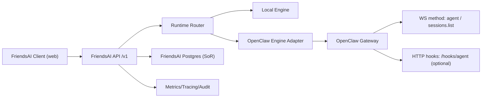

# OpenClaw Agent Layer 集成架构设计（2026-02-18）

## 0. 文档定位
- 类型：架构评审 + 可实施技术方案（OpenClaw 专项）
- 目标：明确 OpenClaw 在 FriendsAI 双栈改造中的职责边界、协议契约、隔离安全、回退策略与上线路径
- 读者：后端开发、平台工程、测试、SRE
- 关联仓库：
  - FriendsAI：`/Users/haoqi/OnePersonCompany/friendsAI`
  - ClawFriends(OpenClaw)：`/Users/haoqi/OnePersonCompany/ClawFriends`

## 1. 背景与目标

### 1.1 背景
FriendsAI 当前已在 Skills Runtime 层接入 OpenClaw reload 控制面（`engine=local|openclaw`），但 Agent 主链路（`/v1/agent/chat`、`/v1/agent/run`）仍是本地执行链路。  
本设计文档聚焦 OpenClaw 侧：明确其在未来 FriendsAI 双栈引擎中的能力边界与集成协议，避免“控制面已通、执行面不清”的风险。

### 1.2 目标
1. 冻结 OpenClaw 控制面契约（尤其 `POST /skills/reload` v1/v2）。
2. 明确 OpenClaw 在执行面中的位置（WS `agent` 方法、`sessions.list`、`/hooks/agent`）。
3. 定义多租户隔离与鉴权边界，确保无跨租户会话/工作区泄露。
4. 给出失败回退、观测审计、分阶段上线与回滚策略。

### 1.3 非目标
1. 不在本轮实现 OpenClaw 内部业务工具能力迁移。
2. 不重写 FriendsAI 前端聊天协议。
3. 不在本轮将 FriendsAI 结构化 `run` 全量迁移到 OpenClaw。

## 2. 当前能力现状（As-Is）

### 2.1 已实现入口（ClawFriends）
1. `POST /skills/reload` 控制面端点已存在：`src/gateway/skills-reload-http.ts`。
2. HTTP 网关已接入 skills reload handler：`src/gateway/server-http.ts`。
3. WS `agent` 方法已存在：`src/gateway/server-methods/agent.ts`。
4. WS `sessions.list` 已存在：`src/gateway/server-methods/sessions.ts`。
5. `/hooks/agent` 已存在并支持 token 校验与 sessionKey 策略：`src/gateway/server-http.ts` + `src/gateway/hooks.ts`。

### 2.2 `POST /skills/reload` 当前行为
1. 路径：`/skills/reload`。
2. 方法：仅 `POST`，非 POST 返回 `405`。
3. 鉴权：Bearer token（通过 gateway auth 流程）。
4. 参数校验：
  - 必填：`tenantId`、`agentScope`、`desiredHash`、`skills[]`。
  - `protocolVersion` 支持 `v1|v2`。
  - `v2` 时要求 `traceId`。
5. 响应（当前控制面行为）：
  - `200` + `ok=true`
  - `executionMode="control-plane-only"`
  - 回传 `tenantId`、`agentScope`、`desiredHash`、`acceptedAtMs`、`summary`。

### 2.3 OpenClaw 当前角色判定
1. 已具备：控制面接入点、WS 会话执行入口、多 agent/session 路由能力。
2. 尚未在 FriendsAI 主链路启用：Agent chat/run 双栈路由还未落地。
3. 因此现状是“Skills 控制面可用，Agent 执行面待接入”。

## 3. 目标架构（To-Be）



### 3.1 关键原则
1. 对外 API 不变：`POST /v1/agent/chat`、`POST /v1/agent/run`。
2. 数据主权不变：FriendsAI DB 是唯一业务 SoR。
3. OpenClaw 承担：会话执行态、工具编排态、会话存储态（非业务主数据）。
4. 默认可回退：OpenClaw 异常时按策略回退 Local（由 FriendsAI router/policy 决策）。

## 4. 协议与契约（`POST /skills/reload`）

### 4.1 请求契约

#### v1（兼容）
```json
{
  "tenantId": "u_123",
  "agentScope": "u_123",
  "desiredHash": "sha256...",
  "skills": [
    {
      "key": "archive_brief",
      "version": "v1",
      "checksum": "sha256...",
      "exportPath": "/.../archive_brief/v1.json"
    }
  ]
}
```

#### v2（推荐默认）
```json
{
  "tenantId": "u_123",
  "agentScope": "u_123",
  "desiredHash": "sha256...",
  "skills": [
    {
      "key": "archive_brief",
      "version": "v1",
      "checksum": "sha256...",
      "exportPath": "/.../archive_brief/v1.json"
    }
  ],
  "loadActions": ["load:archive_brief@v1"],
  "unloadActions": ["unload:contact_insight@v1"],
  "traceId": "01H...",
  "protocolVersion": "v2"
}
```

### 4.2 响应契约（v2）
```json
{
  "ok": true,
  "executionMode": "control-plane-only",
  "tenantId": "u_123",
  "agentScope": "u_123",
  "desiredHash": "sha256...",
  "acceptedAtMs": 1760000000000,
  "summary": {
    "protocolVersion": "v2",
    "traceId": "01H...",
    "skillsCount": 1,
    "loadActions": 1,
    "unloadActions": 1
  }
}
```

### 4.3 鉴权与安全约束
1. Header：`Authorization: Bearer <token>`。
2. 未授权返回 `401`。
3. token 不写入日志，不写入 mount details。

### 4.4 幂等语义（约定）
1. 幂等键建议：`tenantId + agentScope + desiredHash + protocolVersion`。
2. 相同幂等键重复请求应视为同一重载意图，不重复触发昂贵执行步骤。
3. 对于 v2，`traceId` 用于链路追踪，不作为唯一幂等键来源。

## 5. 隔离与安全设计

### 5.1 隔离维度
1. 租户隔离：`tenantId`。
2. Agent 作用域隔离：`agentScope`。
3. 会话隔离：`sessionKey`（推荐 `agent:<agentId>:...` 格式）。
4. 工作区隔离：每 agent 独立 workspace / agentDir。

### 5.2 安全策略
1. 默认只开放必要控制面端点（`/skills/reload`）。
2. OpenClaw 工具执行遵循最小权限原则：
  - 早期仅只读工具或受控工具。
  - 写类工具必须由 FriendsAI `tool-confirmations` 作为最终闸门。
3. `/hooks/agent` 对外暴露时：
  - 必须启用 token。
  - 默认禁用外部任意 sessionKey（除非显式配置允许）。

## 6. 失败与回退策略

### 6.1 错误分类与重试（FriendsAI 侧调用策略）
1. 可重试状态码：`408`、`429`、`5xx`。
2. 可重试错误：timeout / network / fetch failed / abort。
3. 默认超时：`SKILL_OPENCLAW_RELOAD_TIMEOUT_MS`（代码默认 6000ms）。
4. 默认最大重试：`SKILL_OPENCLAW_RELOAD_MAX_RETRIES`（代码默认 2）。

### 6.2 引擎策略矩阵

| 场景 | strict_openclaw | fallback_local |
|---|---|---|
| reload 成功 | `applied` | `applied` |
| reload 失败（4xx/不可重试） | `failed` | `applied(degraded=true)` |
| reload 失败（重试耗尽） | `failed` | `applied(degraded=true)` |
| sync disabled | 视为控制面跳过 | 视为控制面跳过 |

### 6.3 回退触发条件
1. OpenClaw 调用超时、网关异常、协议校验失败。
2. 仅当策略明确允许时执行 Local fallback。
3. 回退后必须记录 `fallbackReason` 与 `degraded` 状态。

## 7. 可观测性与审计

### 7.1 必须沉淀字段（mount details）
1. `traceId`
2. `phaseDurationsMs`（resolve/buildPlan/persistPending/reload/persistFinal）
3. `reloadAttempts`
4. `gatewaySummary`（statusCode/executionMode/acceptedAtMs/responseSnippet/fallback）
5. `loadActions` / `unloadActions` / `appliedSkills`

### 7.2 指标建议
1. OpenClaw 命中率：`openclaw_hits / total_runs`。
2. OpenClaw 失败率：`openclaw_failures / openclaw_hits`。
3. 回退率：`fallback_count / openclaw_hits`。
4. 首 token 延迟（chat）与总耗时（run/chat）分桶。

### 7.3 链路追踪
1. FriendsAI `traceId` 透传到 OpenClaw `traceId`。
2. 网关日志输出 `tenant/agentScope/desiredHash/traceId`（脱敏）。
3. 通过 `runId + traceId` 支持跨仓排障。

## 8. 分阶段上线（4 Phases）

### Phase A：路由骨架（不改行为）
1. FriendsAI 引入 Runtime Router 抽象，默认全部 local。
2. OpenClaw 仅保留/验证 skills 控制面。

### Phase B：chat 灰度接入
1. chat 允许按策略命中 OpenClaw 引擎。
2. 保持前端流协议兼容（含自定义 `2:` 事件）。

### Phase C：run capability 灰度
1. `run` 先从 `title_summary` 小流量灰度。
2. 逐步扩展 capability，始终保留 local fallback。

### Phase D：治理收敛
1. 观测、隔离、审计全面对齐。
2. 形成标准化发布门禁与回滚手册。

## 9. 风险、非目标与回滚

### 9.1 主要风险
1. 协议漂移：FriendsAI v2 请求与 OpenClaw handler 校验不一致。
2. 隔离误配：session/workspace 映射错误导致跨租户泄露。
3. 双栈行为分歧：同输入在 local/openclaw 结果结构差异过大。

### 9.2 回滚策略
1. 协议回滚：`SKILL_OPENCLAW_RELOAD_PROTOCOL=v1`。
2. 引擎回滚：将 FriendsAI engine policy 切回 local-only。
3. 流量回滚：关闭 OpenClaw 灰度开关，恢复 Local 全量。

## 10. 验收标准

### 10.1 跨租户隔离
1. 不同 `tenantId` / `agentScope` 的请求不会共享 session/workspace。
2. 无法通过错误 sessionKey 访问他人会话。

### 10.2 协议兼容
1. `POST /skills/reload` v1/v2 均可用。
2. v2 必填字段校验稳定，错误码语义明确（400/401/405/200）。

### 10.3 失败回退
1. 5xx/timeout 可重试，4xx 不重试。
2. strict 与 fallback 行为符合策略矩阵。

### 10.4 可观测性
1. mount details 可解释每次 reconcile 结果。
2. traceId 可串联 FriendsAI 与 OpenClaw 日志。

## 11. 验证命令（建议）
1. FriendsAI（技能重载硬化单测）  
`bun run --cwd packages/server-nestjs test -- skill-loader.service.spec.ts`

2. ClawFriends（skills reload HTTP 契约单测）  
`cd /Users/haoqi/OnePersonCompany/ClawFriends && pnpm vitest run src/gateway/skills-reload-http.test.ts`

3. FriendsAI OpenSpec 变更状态  
`openspec status --change skill-runtime-loader-openclaw-bridge --json`  
`openspec status --change skill-runtime-openclaw-hardening --json`

