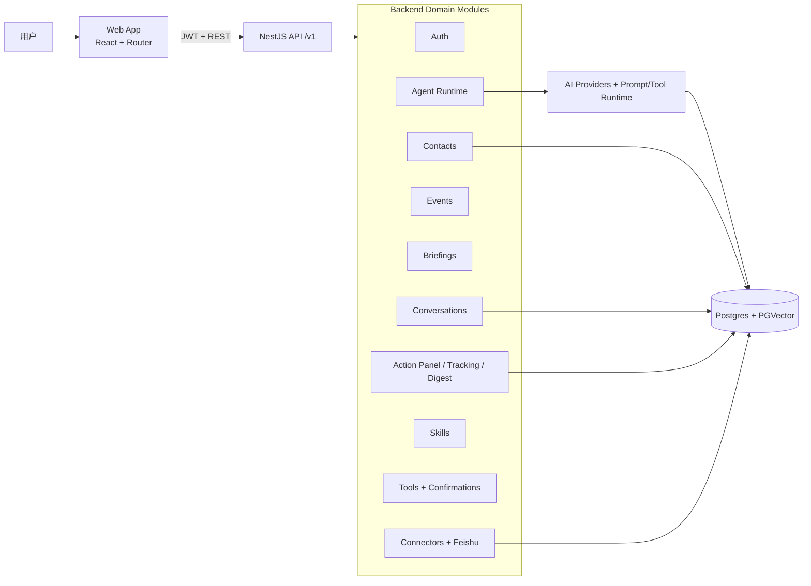

# FriendsAI 当前架构梳理（用于对比 Nanobot）

> 目标：给你一个“拿来就能对照”的架构视图，重点覆盖 **系统分层、Agent 执行链路、数据与状态、扩展机制、工程化约束**。

## 1. 一句话架构定位

FriendsAI 当前是一个 **Monorepo 的 AI Native Web 应用**：
- 前端：`packages/web`（React + Vite）
- 后端：`packages/server-nestjs`（NestJS + TypeORM + PostgreSQL/PGVector）
- 核心交互：`/v1/agent/chat`（流式对话）+ `/v1/agent/run`（一次性结构化执行）

它不是“单纯聊天机器人”，而是把 Agent 能力嵌入在“关系管理业务闭环”里（联系人、会话归档、行动跟进、洞察与简报）。

---

## 2. 逻辑架构图（对比时建议直接复用）

---

## 3. 前端架构（Web）

### 3.1 路由/页面层
- 路由由 `createBrowserRouter` 管理，核心页面包括：
  - `/chat`
  - `/contacts`
  - `/actions`
  - `/conversation/:id`
  - `/contacts/:id`
  - `/settings`
- 通过 `ProtectedRoute` 做登录态保护，业务页面挂在 `AppShell` 内。

### 3.2 交互编排层
- 前端 API 客户端统一在 `lib/api/client.ts`。
- 聊天主链路已收敛到 `useAgentChat`：
  - 流式入口对接 `/v1/agent/chat?format=vercel-ai`
  - 结构化任务入口对接 `/v1/agent/run`（如标题摘要、联系人洞察、归档简报、网络行动建议等）

### 3.3 典型前端分层
- `pages/*`：页面编排
- `components/*`：业务组件 + UI 组件
- `hooks/*`：状态/请求/流式消费
- `lib/api/*`：服务端协议封装
- `schemas/*`：zod 运行时校验

---

## 4. 后端架构（NestJS）

### 4.1 模块化边界
后端采用 NestJS Module 作为边界，`AppModule` 当前加载了较完整的业务域：
- 账户与身份：`AuthModule`
- 关系与内容：`ContactsModule`、`ConversationsModule`、`EventsModule`
- AI 相关：`AiModule`、`AgentModule`、`SkillsModule`
- 洞察与行动：`BriefingsModule`、`ActionPanelModule`、`ActionTrackingModule`、`ActionDigestModule`
- 工具与连接器：`ToolsModule`、`ToolConfirmationsModule`、`ConnectorsModule`、`Feishu*`
- 其他：`ConversationArchivesModule`、`RelationshipsModule`、`AgentDefinitionCenterModule`

### 4.2 运行时横切能力
- 全局鉴权：`APP_GUARD` 注入 `JwtAuthGuard`
- 全局拦截器：HTTP 日志、耗时打点（`TimestampMsInterceptor`）
- Swagger 注解较完整（尤其是 Agent 接口）

### 4.3 数据层
- TypeORM + PostgreSQL
- 支持两个 DataSource：默认库 + `v3` 命名数据源
- `autoLoadEntities: true`，实体自动装载
- `synchronize=false`，依赖 migration

---

## 5. Agent 架构（这是和 Nanobot 对比的重点）

### 5.1 双入口设计
1. **`POST /v1/agent/chat`（流式）**
   - 支持 `sse` 或 `vercel-ai` 格式
   - 事件驱动（start/delta/message/end + ping）
   - 适合聊天窗口与实时工具进度展示

2. **`POST /v1/agent/run`（单次执行）**
   - 输入：`agentId + operation + input + options`
   - 输出：结构化 JSON（含 runId/cached/snapshotId 等）
   - 适合页面级动作和可缓存的“任务式推理”

### 5.2 编排特征
- 统一 orchestrator 承担事件流编排
- 运行指标回写 action-tracking（runId、状态、耗时、错误码）
- 可按环境变量启用“技能输入解析器”，把自然语言路由到 skills 能力

### 5.3 能力模型
从目录结构看，Agent 子系统分为：
- `definitions`：能力定义
- `runtime`：执行器与注册中心
- `capabilities`：具体能力实现
- `storage/snapshots`：结果缓存/快照
- `adapters`：输出流适配（例如 Vercel AI）

---

## 6. 当前系统的“主数据流”

### 6.1 会话与归档主链路
`用户输入 -> /agent/chat -> Agent 编排 -> 结构化落库（会话/联系人事实/待办） -> 前端页面回显`

### 6.2 洞察与行动主链路
`页面触发 -> /agent/run (contact_insight/archive_brief/network_action) -> 结构化结果 -> UI 卡片渲染/行动建议`

### 6.3 工具执行安全链路
`Agent 生成工具建议 -> Tool Confirmation -> 用户确认 -> 执行/追踪`

> 这条链路体现了“AI 建议 + 人类确认”的产品策略，可与 Nanobot 的自动执行策略做重点对比。

---

## 7. 和 Nanobot 对比时建议使用的 8 个维度

> 你可以把下面表格直接复制到评审文档，左边填 FriendsAI（已填），右边填 Nanobot。

| 对比维度 | FriendsAI 当前状态 | Nanobot（待你补） | 关注问题 |
|---|---|---|---|
| 产品定位 | CRM/关系管理内嵌 Agent |  | 是“任务机器人”还是“业务系统里的 AI 层”？ |
| Agent 入口 | chat（流式）+ run（任务式）双入口 |  | 是否也区分交互式与批处理式调用？ |
| 编排模型 | Orchestrator + runtime + capability 分层 |  | 是否支持能力注册、版本化、热插拔？ |
| 工具调用治理 | 明确确认环节（tool confirmations） |  | 自动执行比例如何控制？风险策略？ |
| 数据架构 | 业务数据 + Agent 运行数据并存（tracking/snapshot） |  | 是否可追溯 runId、输入输出与错误？ |
| 前后端协作 | 前端 hook 收敛（useAgentChat）+ 后端统一协议 |  | 协议是否稳定、易于多端复用？ |
| 扩展生态 | Connectors/Feishu/Skills 模块化接入 |  | 插件开发成本、调试成本如何？ |
| 工程治理 | Nest 模块边界、Swagger、迁移管理、测试脚本 |  | 对线上变更、回滚、可观测性支持如何？ |

---

## 8. 我建议你重点看的“差异点”

1. **FriendsAI 更偏“业务闭环驱动”**：Agent 为联系人、关系、行动服务，而不是孤立聊天。
2. **运行时可观测性较强**：有 run 指标记录、状态追踪、stream 事件结构。
3. **安全策略偏保守**：工具确认链路天然抑制误执行。
4. **扩展方向清晰**：skills + connectors + feishu，意味着后续会走“企业工作流嵌入”路线。

---

## 9. 如果你要做一次正式评审（可选）

可以按这个顺序：
1. 先对齐“系统定位差异”（AI 产品 vs AI 能力层）
2. 再对齐“执行模型差异”（chat-first vs run-first）
3. 再看“安全与治理成本”（确认机制、可观测、审计）
4. 最后看“团队可维护性”（模块边界、协议稳定性、测试覆盖）

这样可以避免只比“谁模型更强”，而忽略长期工程成本。
